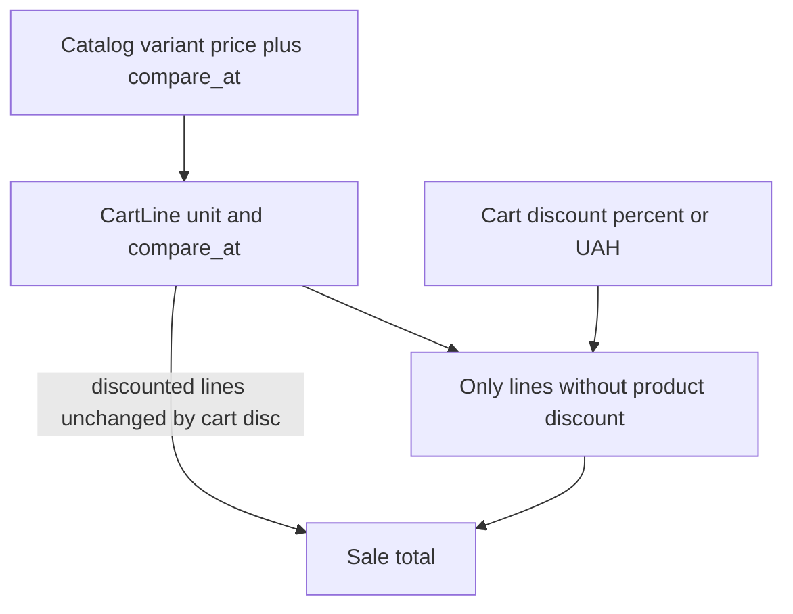

# POS: скидки + клієнти

Спека для реалізації (інший комп / наступний сеанс).  
Референс UI чека: Square Register (лейбл знижки + закреслена сума на рядку).

## Рішення (зафіксовано)

| Тема | Рішення |
|------|---------|
| Знижка товару | На **варіанті** (там ціна). В картці товару в адмінці: режим «%» або «нова ціна + зберегти стару» |
| Знижка чека | **%** або **фіксована ₴**. Застосовується **лише до позицій без товарної знижки**; ₴ розбивається по цих позиціях пропорційно сумі рядків |
| Клієнт у чеку | Клік по шапці правої панелі (як ім’я у Square) |
| Діти | Ім’я + дата народження, **макс. 5** |

Порядок цін: спочатку ціна рядка з урахуванням товарної знижки → потім знижка чека лише на «повні» рядки (без товарної знижки).



---

## 1. Знижка на товар (варіант)

### Схема — частина міграції `005_pos_discounts_customers.sql`

Таблиця `pos_variants` ([`migrations/002_pos_schema.sql`](../migrations/002_pos_schema.sql)):

```sql
ALTER TABLE pos_variants
  ADD COLUMN IF NOT EXISTS compare_at_cents INTEGER NULL
  CHECK (compare_at_cents IS NULL OR compare_at_cents >= 0);
```

Сенс:
- `price_cents` — актуальна ціна продажу
- `compare_at_cents` — «стара» ціна для закреслення; `NULL` = немає товарної знижки

Інваріант (валідація в сервісі): якщо задано `compare_at_cents`, то `compare_at_cents > price_cents`.

### Адмінка ([`pos/src/pages/admin/ProductsPage.tsx`](../pos/src/pages/admin/ProductsPage.tsx))

У блоці варіанта два способи задати знижку (обидва пишуть ті самі поля):

1. **Знижка %** — ввід відсотка: якщо `compare_at` ще немає → `compare_at = поточний price`; `price = round(compare_at * (100 - pct) / 100)`.
2. **Нова ціна** — ввід нової ціни; стара йде в `compare_at_cents` (якщо ще не була); `price_cents = нова`.

Кнопка **«Скинути знижку»**: відновити стару ціну — `price_cents = compare_at_cents`, потім `compare_at_cents = null`.

API: розширити create/update variant — поле `compare_at_cents`  
([`src/pos/products.service.ts`](../src/pos/products.service.ts), [`pos.controller.ts`](../src/pos/pos.controller.ts)).

### Каталог / чек

- `CatalogItem` + `getCatalog`: віддати `compare_at_cents`.
- При `addItem` у [`pos/src/hooks/useCart.ts`](../pos/src/hooks/useCart.ts) заповнювати stub-поля:
  - `unit_price_cents = price_cents`
  - зберігати **unit** `compare_at_cents`; у UI закреслена сума рядка = `compare_at_cents * quantity`
  - `discount_label = «Знижка (N%)»` якщо є compare (`N = round((compare - price) / compare * 100)`)

[`SaleSidebar.tsx`](../pos/src/components/cashier/SaleSidebar.tsx) / [`MobileCartSheet.tsx`](../pos/src/components/cashier/MobileCartSheet.tsx) уже вміють малювати label + strikethrough — підключити реальні дані.

### Продаж

У `completeSale` ([`src/pos/sales.service.ts`](../src/pos/sales.service.ts)): читати `v.price_cents` і `v.compare_at_cents`; писати знімок у `pos_sale_items` (див. поля нижче).

---

## 2. Знижка на весь чек

### Правило розподілу

Позиція **з товарною знижкою** (`compare_at_cents != null` у варіанта на момент продажу) — **не бере участі** у знижці чека.

Позиції **без** товарної знижки — eligible:

- **%**: `cart_discount_cents = round(sum(eligible_line_totals) * pct / 100)`; рознести по eligible пропорційно `line_total` (останній рядок — залишок копійок).
- **₴**: сума не більша за eligible subtotal; рознести пропорційно по eligible; неeligible не чіпати.

Підсумок чека: `total = sum(усіх line_total після аллокації знижки чека)`.

### Схема (та сама міграція `005`)

**`pos_sales`** додати:

| Колонка | Тип | Опис |
|---------|-----|------|
| `customer_id` | `BIGINT NULL REFERENCES pos_customers(id)` | клієнт чека |
| `cart_discount_type` | `VARCHAR(16) NULL` | `'percent' \| 'fixed' \| NULL` |
| `cart_discount_value` | `INTEGER NULL` | для %: 0–100; для fixed: сума в **копійках** |
| `cart_discount_cents` | `INTEGER NOT NULL DEFAULT 0` | фактична сума знижки чека |

- `subtotal_cents` = сума рядків **до** знижки чека (за unit sale prices)
- `total_cents` = після знижки чека

**`pos_sale_items`** додати:

| Колонка | Тип | Опис |
|---------|-----|------|
| `compare_at_unit_cents` | `INTEGER NULL` | знімок старої ціни / шт |
| `line_discount_cents` | `INTEGER NOT NULL DEFAULT 0` | частка **знижки чека** на цей рядок |

Формула: `line_total_cents = unit_price_cents * quantity - line_discount_cents`.

### UI каси

- Внизу чека (над кнопками) або через `…`: «Знижка на чек» → sheet: тип % / ₴, значення, скидання.
- У summary: рядок «Знижка на чек −₴X», якщо > 0.
- State у Zustand cart: `cartDiscount: { type, value } | null`.
- `completeSale` payload:

```ts
{
  items: Array<{ variant_id: number; quantity: number }>;
  payments: Array<{ method: 'cash' | 'card'; amount_cents: number }>;
  cart_discount?: { type: 'percent' | 'fixed'; value: number } | null;
  customer_id?: number | null;
  note?: string;
}
```

**Сервер — джерело істини:** перерахувати знижку чека на бекенді за тими самими правилами (не довіряти клієнтським сумам).

---

## 3. Клієнти

### Схема

```sql
CREATE TABLE IF NOT EXISTS pos_customers (
  id BIGSERIAL PRIMARY KEY,
  store_id BIGINT NOT NULL REFERENCES pos_stores(id) ON DELETE CASCADE,
  name VARCHAR(255) NOT NULL,
  phone VARCHAR(32) NOT NULL,  -- нормалізувати digits; UNIQUE (store_id, phone)
  email VARCHAR(255) NULL,
  children_birthdays JSONB NOT NULL DEFAULT '[]',
  -- [{ "name": "Оля", "birthday": "2019-03-12" }, ...] max 5
  created_at TIMESTAMPTZ NOT NULL DEFAULT NOW(),
  updated_at TIMESTAMPTZ NOT NULL DEFAULT NOW()
);

CREATE UNIQUE INDEX IF NOT EXISTS idx_pos_customers_store_phone
  ON pos_customers (store_id, phone);
```

`pos_sales.customer_id` — FK nullable (див. вище).

### Валідація children

- Масив ≤ 5 елементів.
- Кожен елемент: **`name` (непорожній) + `birthday` (ISO date `YYYY-MM-DD`)** — обидва обов’язкові.

### API (`/api/pos/customers`)

| Method | Path | Auth | Нотатки |
|--------|------|------|---------|
| GET | `/customers?q=` | any POS | пошук по імені / телефону |
| GET | `/customers/:id` | any POS | |
| POST | `/customers` | any POS | каса теж заводить |
| PATCH | `/customers/:id` | any POS | |
| DELETE | `/customers/:id` | owner | якщо є продажі — заборонити або anonymize; без продажів — hard delete |

Новий сервіс: [`src/pos/customers.service.ts`](../src/pos/customers.service.ts) (стиль як `tags.service.ts`).  
Зареєструвати в [`pos.controller.ts`](../src/pos/pos.controller.ts) / plugin.

### Адмінка

- Вкладка **«Клієнти»** у [`AdminLayout.tsx`](../pos/src/pages/admin/AdminLayout.tsx) → `/admin/customers`.
- Сторінка: список + пошук + форма create/edit (ім’я, телефон, email, до 5 дітей).

### Каса

- [`AppRail.tsx`](../pos/src/components/cashier/AppRail.tsx) + [`BottomNav.tsx`](../pos/src/components/cashier/BottomNav.tsx): пункт **Клієнти** → `/customers` (доступний seller).
- Сторінка списку / створення (спрощена).
- У [`SaleSidebar.tsx`](../pos/src/components/cashier/SaleSidebar.tsx): клік по шапці → picker: пошук / створити / «Без клієнта»; вибраний клієнт у state кошика; у header — **ім’я клієнта** (staff дрібніше або в `…`).

`completeSale` передає `customer_id`; деталі продажу і список продажів показують клієнта.

Маршрути в [`pos/src/App.tsx`](../pos/src/App.tsx): `/customers`, `/admin/customers`.

---

## 4. Міграція і деплой

Один файл: **`migrations/005_pos_discounts_customers.sql`**  
(порівняльна ціна варіанта + клієнти + поля знижки чека на sales/sale_items).

Додати в список [`src/pos/migrate.ts`](../src/pos/migrate.ts) і в тести, що вантажать міграції.

На Railway API стартує з `node dist/pos/migrate.js && node dist/index.js` — після деплою міграція підхопиться сама.

---

## 5. Чеклист файлів

### Backend
- [x] `migrations/005_pos_discounts_customers.sql`
- [x] `src/pos/migrate.ts` — додати `005`
- [x] `src/pos/customers.service.ts` + controller routes
- [x] variants: `compare_at_cents` у create/update/catalog
- [x] `sales.service.ts` — аллокація знижки чека, snapshot compare_at, `customer_id`
- [x] types (`src/pos/types.ts`, FE `pos/src/types.ts`)

### Frontend
- [x] `api.ts` — customers CRUD, completeSale extras, variant compare_at
- [x] `useCart.ts` — discount fields з каталогу, `cartDiscount`, `customerId`
- [x] `ProductsPage.tsx` — UI знижки варіанта
- [x] `SaleSidebar` / `MobileCartSheet` — реальні знижки рядка, знижка чека, клієнт у шапці
- [x] `CustomersPage` admin + cashier
- [x] `App.tsx`, `AdminLayout`, `AppRail`, `BottomNav`
- [x] [`pos/UI_CASHIER.md`](../pos/UI_CASHIER.md) — коротко про знижки/клієнта

### Не в scope
- Save basket
- Лояльність / автознижки за ДН дітей
- SMS

---

## 6. Приклад аллокації знижки чека (копійки)

Eligible рядки: A=10000, B=30000 (коп.). Fixed знижка чека = 4000.

- частка A: `floor(4000 * 10000/40000) = 1000`
- B отримує залишок: `4000 - 1000 = 3000`
- Рядки з `compare_at` не змінюються.
